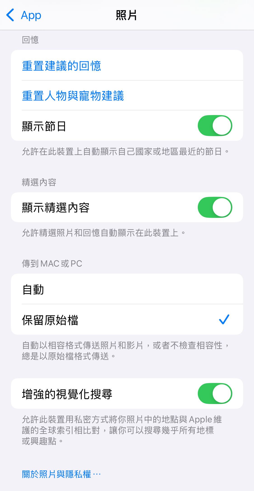
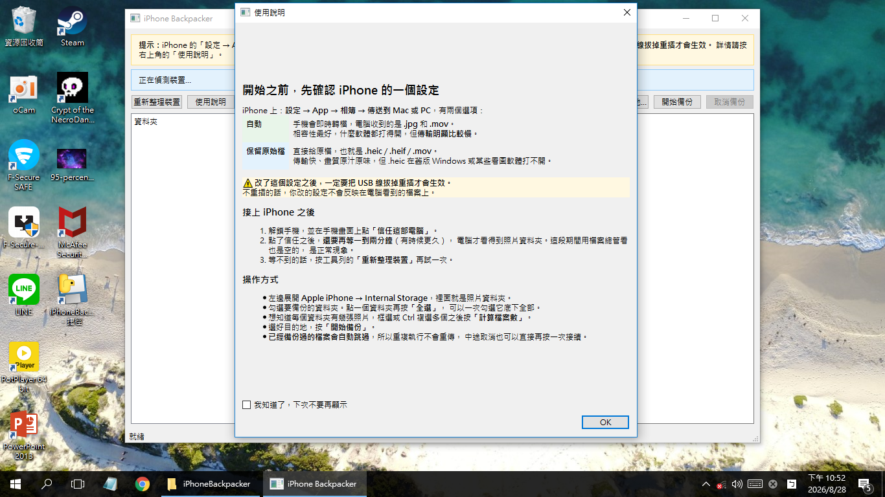
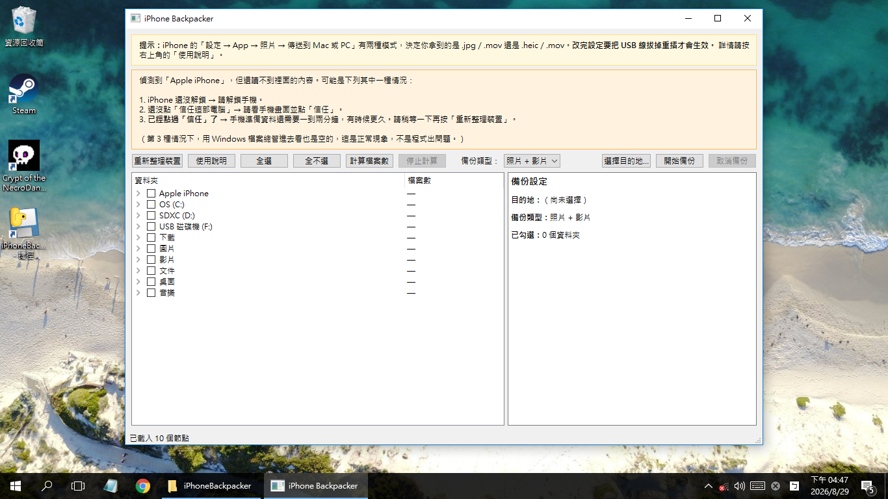
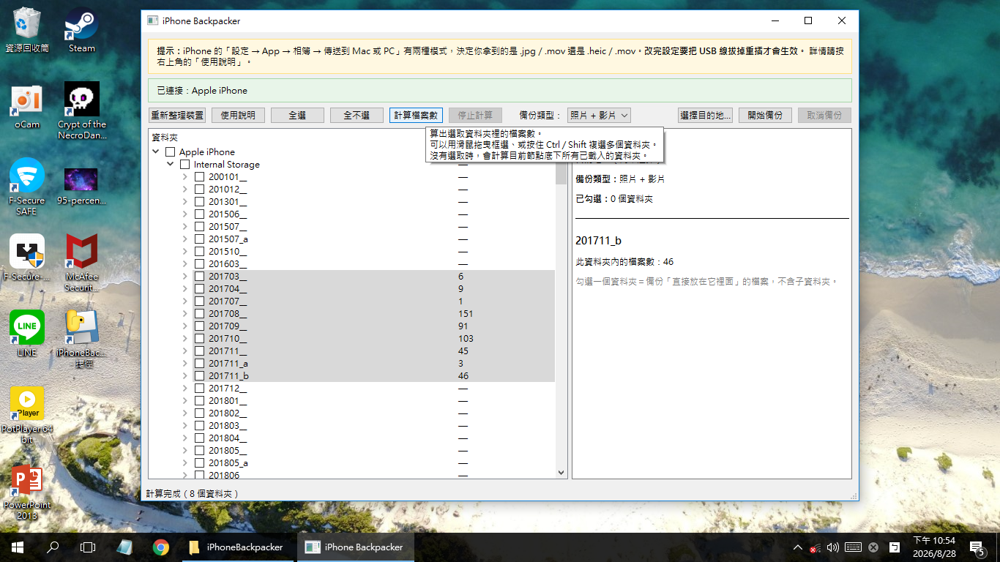
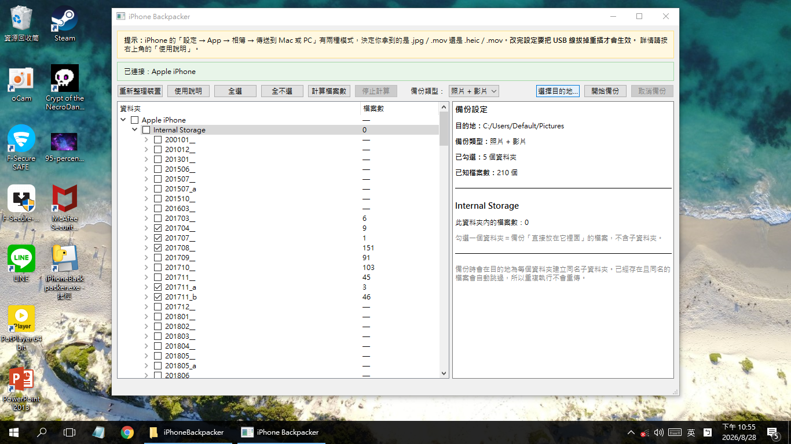
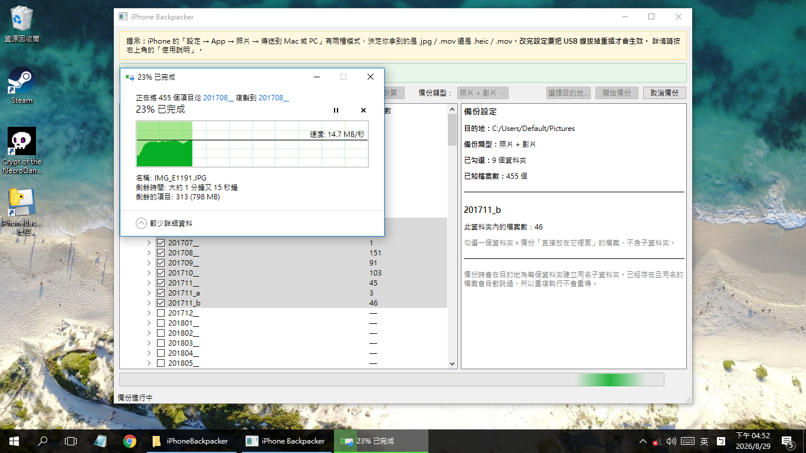
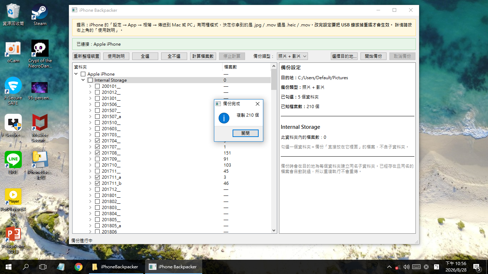

# iPhone Backpacker

把 iPhone 的照片和影片備份到 Windows 電腦。**免安裝、不連網路、不需要管理員權限**，
下載解壓縮就能用。

照片不用先上傳雲端，全程只在你自己的電腦上。

> **為什麼不直接用檔案總管？** 因為它很慢。iPhone 透過 MTP 連上 Windows 時，
> 檔案總管會為每張照片抓縮圖、逐項查詢大小和日期，點進一個資料夾就要等很久；
> 整個資料夾直接拖曳複製又容易中途失敗，而且失敗了不會告訴你是哪幾個檔案。
>
> 這個工具刻意**不抓縮圖、不查詳細資料**，只做備份該做的事。

---

## 系統需求

- **Windows 10 或 11**（64 位元。不支援 Windows 7／8）
- iPhone 一台，以及**能傳輸資料的** USB 線（有些充電線只能充電）

---

## 下載

到 [Releases](../../releases) 下載 `iPhoneBackpacker.zip`，解壓縮之後執行
`iPhoneBackpacker.exe`。

**不需要安裝 Python**，也不需要安裝任何東西 —— 執行檔需要的所有元件都在
`_internal` 資料夾裡。

> ⚠ **不能只複製 `iPhoneBackpacker.exe`。** 它需要同資料夾裡的其他檔案才能執行，
> 要搬就整個資料夾一起搬。

不放心執行別人打包的 exe？可以[直接跑原始碼](#從原始碼執行)或[自己打包](docs/BUILD.md)。

---

## 使用方式

### 步驟 0：先確認 iPhone 的設定

iPhone 上：**設定 → App → 照片 → 傳送到 Mac 或 PC**



| 選項 | 你會拿到 | 取捨 |
|---|---|---|
| **自動** | `.jpg` / `.mov` | 手機即時轉檔，相容性最好，但**傳輸慢很多**，備份影片時尤其明顯 |
| **保留原始檔** | `.heic` / `.heif` / `.mov` | 傳輸快、畫質原汁原味，但 `.heic` 在某些看圖軟體打不開 |

> ⚠ **改了這個設定，一定要把 USB 線拔掉重插才會生效。**

**建議：要備份影片就選「保留原始檔」。** 原因見下面的[常見狀況](#複製速度變成-0-位元組)。

### 步驟 1：開啟程式

第一次執行會顯示使用說明，看完可以勾「不要再顯示」。之後想再看，按工具列的
**「使用說明」**。



### 步驟 2：接上 iPhone，等它準備好

1. 用 USB 線接上電腦。
2. **解鎖手機**，並在手機畫面上點**「信任這部電腦」**。
3. 點了信任之後，**還要再等一到兩分鐘**（有時候更久），電腦才看得到照片資料夾。

這段期間程式會顯示下面這個提示。**這是正常現象** —— 這時候用 Windows 檔案總管
進去看也是空的，不是程式壞了。等一下再按**「重新整理裝置」**就好。



> 🔧 **電腦一直看不到 iPhone？**
> [docs/TROUBLESHOOTING.md](docs/TROUBLESHOOTING.md) 有一張檢查流程圖，
> 從「還沒插線」到「看得到照片資料夾」中間會卡住的地方都列出來了。

### 步驟 3：挑資料夾

左邊展開 **Apple iPhone → Internal Storage**，裡面就是照片資料夾
（`202408__` 這種日期命名）。

- 勾選要備份的資料夾
- 點一個資料夾再按**「全選」**，可以一次勾選它底下的全部
- 想先知道每個資料夾有幾個檔案：用滑鼠框選或按住 Ctrl 複選多個，再按
  **「計算檔案數」**。數字會一個一個填上去，隨時可以按「停止計算」



### 步驟 4：選目的地

按**「選擇目的地…」**指定要備份到哪裡。程式會在裡面為每個資料夾建立同名子資料夾。



### 步驟 5：開始備份

按**「開始備份」**。程式會先讀取檔案清單，然後交給 Windows 原生的複製視窗
（有進度、剩餘時間、取消鈕）。不管選了幾個資料夾，這個視窗**只會出現一次**。



### 步驟 6：完成



---

## 好用的細節

- **已經備份過的檔案會自動跳過。** 所以重複執行不會重傳，中途取消也可以直接
  再按一次「開始備份」接續 —— 不會從頭來過。
- 有檔案沒複製成功時會列出檔名，按**「重試未完成的項目」**通常就會成功
  （多半是 USB／MTP 傳輸的暫時性問題）。
- 資料夾清單不完整時按**「重新整理裝置」**。這是 Windows 對 MTP 的已知毛病，
  真的還是不對就把 USB 拔掉重插。

---

## 常見狀況

### 複製速度變成 0 位元組

**這幾乎一定是因為 iPhone 設定成「自動」。**

「自動」模式下，手機要**即時轉檔**（HEIC→JPG、HEVC→H.264）。Windows 跟 iPhone
要一個檔案時，手機必須先把整個檔案轉完才有資料可以送 —— 這段期間連線是通的但
沒有資料流動，所以進度視窗顯示 0 B/s。照片小、轉得快，感覺不明顯；
**影片大，轉檔可能要好幾分鐘**，就會看起來像卡死。

**這不是當掉，等下去通常會繼續。** 但如果你要備份影片，建議：

1. iPhone 上 **設定 → App → 照片 → 傳送到 Mac 或 PC**，改成**「保留原始檔」**
2. **把 USB 線拔掉重插**（不重插設定不會生效）
3. 重新備份


改完之後傳輸是直接送原始檔，速度會穩定很多。真的需要 JPG 的話，在電腦上轉檔
比讓手機轉快得多。

### 電腦看不到 iPhone

[docs/TROUBLESHOOTING.md](docs/TROUBLESHOOTING.md) 有完整的檢查流程圖。
最常見的三個原因：

1. **USB 線只能充電、不能傳資料** —— 外觀看不出來，換一條原廠線試試
2. **手機沒解鎖，或沒點「信任這部電腦」**
3. **點了「信任」之後還要再等 1～2 分鐘** —— 這段期間資料夾本來就是空的

### 第一次執行時 Windows 擋下來

這個程式沒有買數位簽章憑證（一年上萬元，對免費工具不划算），所以：

- **SmartScreen 跳「Windows 已保護您的電腦」** → 點「其他資訊」→「仍要執行」
- **防毒軟體誤判** → PyInstaller 打包的程式被誤判是常見狀況。把資料夾加進白名單，
  或到 [Microsoft Security Intelligence](https://www.microsoft.com/en-us/wdsi/filesubmission)
  提交誤判回報

程式**不會連上網路**，也**不需要管理員權限**。不放心的話請[直接跑原始碼](#從原始碼執行)。

### 要回報問題

工具列上按**「產生診斷報告」**，會在**桌面**產生一個 `.txt` 檔，
把它傳給開發者就好。裡面有系統資訊、裝置偵測的判斷依據、資料夾清單
與最近的執行紀錄，**不包含你的照片**。

如果是某個資料夾的檔案數看起來不對，**先點選那個資料夾再按**，
報告會多做一段針對它的檢查。

需要原始紀錄檔的話在這裡：

```
%LOCALAPPDATA%\iPhoneBackpacker\logs\backpacker.log
```

---

## 從原始碼執行

不想用打包好的 exe、想自己檢查程式碼的話：

```bash
git clone https://github.com/3chdog/iPhone-Backpacker.git
cd iPhone-Backpacker

pip install -r requirements.txt
python run_gui.py
```

需要 **Python 3.12**（Windows 10/11 64 位元）。相依套件只有兩個：
`pywin32` 和 `PySide6`。

- **想自己打包成 exe** → [docs/BUILD.md](docs/BUILD.md)
- **電腦沒有網路** → [docs/OFFLINE-INSTALL.md](docs/OFFLINE-INSTALL.md)

---

## 這東西怎麼運作的

iPhone 接上 Windows 走 **MTP**：檔案總管看得到，但**沒有磁碟機代號、也沒有真實路徑**。
所以 Python 的 `os.listdir()` / `pathlib` / `shutil` 完全看不到手機裡的檔案。

本專案透過 **Windows Shell COM**（`IShellFolder` / `IShellItem` / `IFileOperation`）
存取，也就是檔案總管本身在用的那條路。

想改 code 的話，`docs/ai/` 底下有完整的架構說明、決策紀錄（含為什麼否決某些方向）
與 Windows Shell COM 的踩坑筆記，動手前請先讀 `CLAUDE.md` 和
`docs/ai/01-architecture.md`。

---

## Credits

**[3chdog](https://github.com/3chdog/)**

[](https://github.com/3chdog/)
